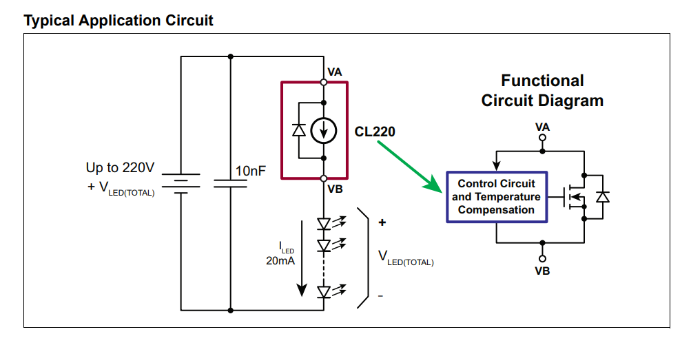
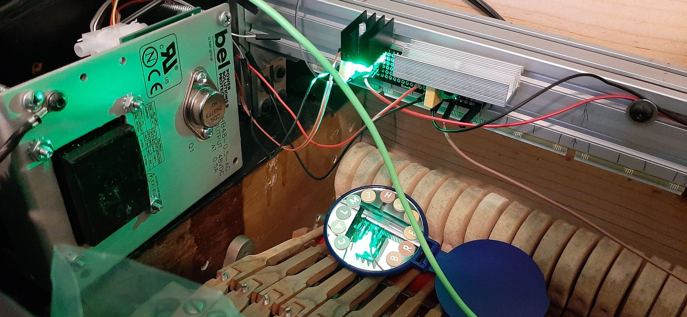

# Alternative power supply

The original power supply for the IPS in STEM piano feeds all current through the main board and assumes that each sensorboard
has its own current-limiting resistor and its own power cable. This forces one to be very careful, cut the Teensy USB power 
pad as described [here](https://github.com/stem-piano/stem-piano-g-main/blob/main/documentation/construction_subsections/subsection3a_circuit_board_assembly.md#install-the-teensy-41),
and have an additional cable from the IPS to the sensorboards (three cables).

An alternative, constant-current, power supply approach eliminates all these problems:

* no current-limiting resistors needed because the system feeds a very stable constant current to begin with
* all the LED current flows on the sensorboars only, allowing very short cabling from one sensorboar to the next, rather than the long and tedious to install
ones going to the IPS (two cables only needed for the sensor, especially if the biasing resistor is moved to the ACE interposer boards rather than staying on the sensorboards)
* the Teensy USB pad can be left there, simplifying wiring to the computer, more convinient if one prefers to use USB-MIDI rather than DIN-MIDI

# Principle of operation

A Temperature-Compensated, Constant-Current, [CL220](https://ww1.microchip.com/downloads/en/DeviceDoc/20005413A.pdf) is the heart of the system.The CL220, when wired as in
the _Typical Application Circuit_ on page of the datasheet, simply provides very stable 20mA current, at the voltage it is powered. That circuit is so simple that no PCB
has been designed for it: there is only headers for the input voltage, the CL220, a capacitor and headers for the output.

&nbsp;&nbsp;&nbsp;&nbsp;&nbsp;&nbsp;&nbsp;&nbsp;**Figure 1: Typical Application Circuit**

For input voltage, a linear power supply is best for its stability. Since there are 88 LEDs for the hammer sensors (and optionally 88 more for damper sensors, and optionally a few more
for pedals), one will need to consider how many Volts are needed. The LEDs in both the CNY70 and the QRE1113 have a drop voltage between 1.2V and 1.6V, which means that if you want to
power them all in a single series you will need at the very least `88 * 1.2V = 105V` and you should actually design the circuit for the worst case of `88 * 1.6V = 140V`. Or double that
for the dampers, not to mention the pedals. Those voltages are unpractical, so using multiple series is best. Each series will have its own CL220 and optionally its whole _Typical Application
Circuit_ (i.e. capacitor and separate input headers).
The number of series is arbitrary, but the linear voltage power supply needs to be able to provide enough voltage for each series, and enough current for the combined number of series.
Practical and economic considerations make a 48V 0.5A (i.e. 500mA) power supply the ideal choice: making 6 series of 32 sensors each (for a total of 192 sensors) is enough for all hammer,
damper and pedal sensors. Having 32 sensors per series is a bit bordeline for the worst case (since 1.6V * 32 = 51.2V which is more than the 48V provided by the linear supply), but in
practice it worked just fine (because 1.6V per LED is the absolute maximum possible voltage drop, and the average is way less). With 6 series, each needing 20mA, draws a total of 120mA
(perhaps plus some overhead), well within the 500mA of the maximum specs for the linear supply, and at a level in which its efficiency is also maximized.

An off-the-shelf [HB48-0.5-AG](https://www.belfuse.com/resources/datasheets/powersolutions/ds-bps-linear-series.pdf) perfectly fits the bill: it is readily available from major
electronic resellers, it is not too expensive, it is tested one-by-one at the factory (a report with its performance is provided) and has an incredibly stable output (mine, for example,
states a ripple of 0.005% which is way less than I am able to measure). Such a stable output completely remove one possible source of noise in the hammer position reading.

The HB48 linear power supply costs just a bit more than $50 at time of writing. The CL220s, its heatsink and the 20nF capacitors will cost about $5 per set, so $15 if one wants to
power only the hammer sensors, or $30 if one wants to power also the damper sensors.

Note the two CL220 with their heat sinks (very overkill, they don't even become warm) and one extra green LED (in series with the IR ones in the sensorboards) to verify everything is
working
