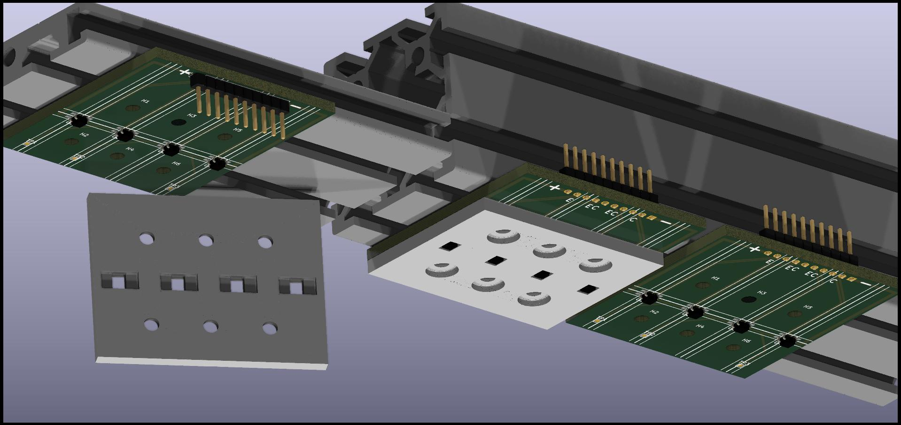

# Summary of files in this directory

These are the KiCad files for a sensorboard containing 4 QRE1113GR (surface mount) as in the raytracing below.

The files are named 2040-centered-4x-QRE1113GR because:

1. They fit on a 2040 extrusion
2. The sensors are centered
3. There are 4 sensors per board
4. The sensor is a QRE1113GR (SMT, but there is an equivalent through hole, if you prefer to solder it yourself and are more comfortable with through hole tech)

The QRE1113-protector.stl is the 3D-print model for the sensor protector.

# Explanation

The image depicts an assembly of sensorboards on thick and thin rails (in dark gray, on the top).
The thick rails will be used for hammer sensors. The hammers will come from down in this picture
and the keys are "inside the screen" toward the left.

The lighter grey "sensor protector" will absorb at least part of the hammer impacts.
All the hammer boards will have those installed, but it is not shown on the board
to the right to show better the board itself. There is a levitating "sensor protector"
on the left, showing the other side with the clearance for the pins.

The board on the left, on the thinner extrusion is identical to the others. The assembly
is slightly different in that the jumper connector will be mounted on
the other side of the board. That, and the thinner extrusion make it a "key sensor" board.
It will need to be flipped upside down for the purpose, and lowered under the keys which
are not shown in this image. All keys will have them (also the keys not damped on a piano:
note off is still needed for MIDI even if it might be ignored by the virtual instrument for
the highest notes of the piano).

More detailed assembly instructions (with pictures) can be found [here](https://pianoclack.com/forum/d/542-update-on-piano-conversion/50)

These can be purchased
[here](https://www.pcbway.com/project/shareproject/W341931AX1N3_gerber_54f46d6c.html)

# Mechanical

Instead of using regular aluminum extrusions, these sensorboards fit perfectly with the specialty ones linked below.

Advantages of specialty extrusions:

* extreme sturdiness, lack of vibrations, flex and bends: things stay where you put them
* very easy adjustment of sensors possible: need to move them a bit left or right? Just a loosen the bolt, move them and tighten back!
  * The nut is automatically taken care of!
  * No need to redrill!
* much easier manufacturing and assembly: just put the sensors where you need them! No measurement, no drilling and no drilling mistakes if you put them in the wrong place!

The extrusions I used are for the hammer sensors are https://us.misumi-ec.com/vona2/detail/110302684530/ and for the key (dampers) sensors are https://us.misumi-ec.com/vona2/detail/110302261730/ but of course many alternatives exist. I prefer MISUMI as the market leader in the field having a top-notch product, rather than saving a few dollars and encountering flex problems, or difficulty matching the nuts.
